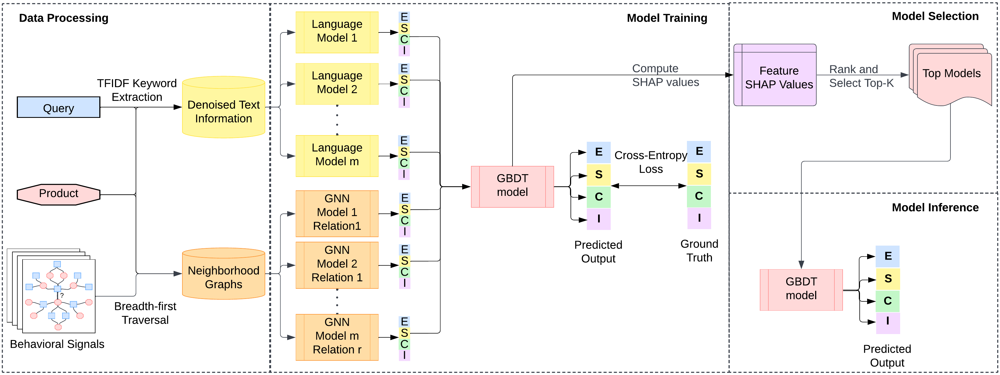

# Explainable Search Relevance using Graph-Enhanced Plug and Play Language Models

E-commerce search relevance is a challenging task as it involves understanding it with the appropriate products in the catalog. The problem has traditionally been addressed using language models (LMs) and graph neural networks (GNNs) to capture semantic and inter-product behavior signals, respectively. However, the rapid development of   new architectures has created a gap between research and practical adoption of these techniques. Evaluating the generalizability of these models for deployment requires extensive experimentation on complex, real-world datasets, which can be non-trivial and expensive. Furthermore, such models often operate on a latent space representations that are incomprehensible to humans, making it difficult to evaluate and compare the effectiveness of different models. This lack of interpretability hinders the development and adoption of new techniques in the field. To bridge this gap, we propose Plug and Play Graph LAnguage Model (PP-GLAM), an explainable ensemble of plug and play models. Our approach uses a modular framework with uniform data processing pipelines. It employs additive explanation metrics to independently decide whether to include (i) language model candidates, (ii) GNN model candidates,  
and (iii) inter-product relation types. For the task of search relevance, we show that PP-GLAM outperforms several state-of-the-art baselines as well as a proprietary model on real-world multilingual, multi-regional e-commerce datasets. To promote better model  
comprehensibility and adoption, we also provide an analysis of the explainability and computational complexity of our model. We also provide the public codebase, release a dataset of behavioral signals and provide deployment strategy for practical implementation.




## Environment Installation

```bash
# Please make sure torch-geometric, transformers
# and pytorch-lightning are compatible with each other
# and supported by your setup.
pip install pyg-lib torch-scatter torch-sparse
-f https://data.pyg.org/whl/torch-${TORCH_VER}+${CUDA_VER}.html
pip install torch-geometric
pip install -r graph_src/requirements
pip install -r src/requirements
```

## Run
### Training PP-GLAM model
```bash
# Training language models.
cd src/
# Update parameters in lm_config.py
python retrain_tokenizers.py
python trainer.py

# Training graph models.
cd graph_src/
# Update parameters in graph_config.py
python graph_trainer.py

# Model Checkpoints are by-default stored in ../model_checkpoints/
# Use the models to get predictions over training dataset.
# Aggregate the features in a table (X_train,y_train).
```
```python
# Run ensemble model
import lightgbm
lgb_model = lgb.LGBMClassifier(
    objective = 'multiclass',
    class_weight = "balanced",
    boosting_type = "gbdt",
    num_iterations = 1500,
    learning_rate = 0.005,
    num_leaves = 25,
    max_depth = 25,
    min_data_in_leaf = 25,
    feature_fraction = 0.8,
    bagging_fraction = 0.8,
    bagging_freq = 200,
    n_jobs = [#CPU_THREADS]
)
lgb_model.fit(X_train,y_train)
from joblib import dump
dump(lgb_model, 'pp_glam_ensemble_model.joblib')
```

### Evaluating PP-GLAM model
```bash
# Evaluating language models.
cd src/
# Update parameters in lm_config.py
python evaluator.py

# Evaluating graph models.
cd graph_src/
# Update parameters in graph_config.py
python graph_evaluator.py

# Model Checkpoints are by-default stored in ../model_checkpoints/
# Use the models to get predictions over training dataset.
# Aggregate them in a table X_test.
```
```python
# Run ensemble model
from joblib import load
lgb_model = load('pp_glam_ensemble_model.joblib')
y_test = lgb_model.predict(X_test)
```
## Dataset Processing
The paper uses dataset provided here; https://github.com/amazon-science/esci-data

Language Model:
```bash
cd src
python dataset.py
```
Graphs:
```bash
cd graph_src
python graph_dataset.py
```
Preprocessed datasets coming soon.

## Paper
Currently under revision.
